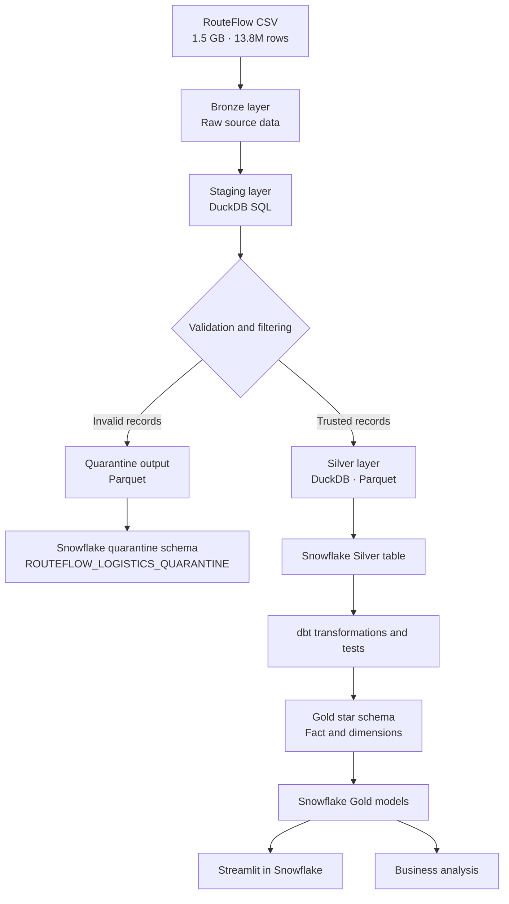
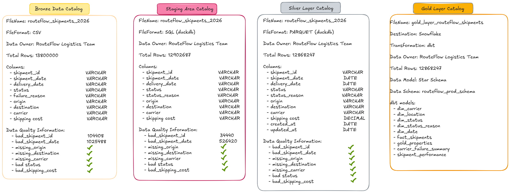

# RouteFlow Logistics — Delivery Failure Intelligence

> An end-to-end data engineering project that processes 13.8 million shipment records, quarantines invalid data, and prepares trusted shipment-performance data for analytics in Snowflake.

## Overview

RouteFlow Logistics processes thousands or millions of shipments. The business needs reliable data to measure delivery performance, investigate failed deliveries, compare carrier performance, and identify failure trends.

For this project, I built a pipeline that:

- Processes a **1.5 GB CSV containing 13,800,000 shipment records**
- Preserves the original data in a Bronze layer
- Uses DuckDB SQL for staging, standardization, and Silver-layer transformations
- Preserves invalid records in a separate Parquet quarantine output
- Loads both the quarantine data and trusted Silver data into Snowflake
- Uses dbt to build a dimensional Gold layer and analytical models
- Applies dbt data-quality tests
- Makes the Gold data available for business analysis and a Streamlit dashboard in Snowflake

The pipeline follows a Medallion Architecture:

**Bronze → Staging → Silver → Gold**

This README documents both the project design and the steps needed to recreate the workflow. Adapt object names, paths, credentials, and SQL to your own environment.

## Business Problem

The source shipment data contains quality issues, including malformed dates, invalid shipment IDs, inconsistent status values, and records that should not flow into trusted analytical datasets.

Simply dropping invalid records would hide source-data problems. This pipeline therefore separates records into two paths:

- **Trusted path:** records that pass the implemented validation rules continue to the Silver and Gold layers.
- **Quarantine path:** invalid records are written to a separate Parquet output and loaded into a dedicated Snowflake schema for investigation.

This preserves visibility into source-data quality while giving analysts a more trustworthy dataset.

## Business Questions

1. How many shipments failed?
2. What percentage of shipments fail?
3. Why are deliveries failing?
4. Which carriers have the highest failure rates?
5. When are failures happening?
6. What failure reasons are increasing?

## Business KPIs

| KPI | Description |
|---|---|
| Total shipments | Number of shipments processed |
| Failed shipments | Number of shipments with a failed status |
| Successful deliveries | Number of shipments marked as delivered |
| Delivery failure rate | Failed shipments as a percentage of total shipments |
| Failure cost | Shipping cost associated with failed shipments |
| Failure rate by carrier | Failure rate for each carrier |
| Failure rate by reason | Number of failures associated with each reason |

## Architecture



## Technology Stack

| Technology | Role in the project |
|---|---|
| Python | Runs data-generation and Snowflake-connection scripts |
| DuckDB | Processes the large source file and builds staging and Silver data |
| Parquet | Stores the transformed Silver data and quarantine output |
| Snowflake | Stores trusted Silver data, quarantined records, and Gold models |
| Snowflake Python Connector | Connects Python to Snowflake |
| dbt | Builds the Gold dimensional model and analytical models; runs data tests |
| `dbt_utils` | Generates surrogate keys and creates a date spine |
| Streamlit in Snowflake | Presents data for interactive analysis |

## Why DuckDB?

The source was supplied as a large CSV, and Snowflake was the target warehouse. DuckDB provided a lightweight SQL-based way to process the file locally without requiring a separate database server.

DuckDB was used for the initial staging transformations and Silver-layer validation. The trusted Silver data was then written to Parquet for loading into Snowflake, where dbt builds the Gold models.

# Pipeline Implementation

## 1. Generate the source dataset

The project includes a Python script named `generate_routeflow_data.py` to generate the synthetic shipment dataset.

Run it from the project directory:

```bash
python generate_routeflow_data.py
```

The generated file is:

```text
routeflow_shipments_2026.csv
```

The generated dataset used for this project contains 13.8 million records and is approximately 1.5 GB. If you use the generator yourself, the resulting size can vary with the generator's configuration.

## 2. Bronze layer

The Bronze layer represents the raw source CSV before downstream transformations.

**Source details**

- File: `routeflow_shipments_2026.csv`
- Format: CSV
- Size: approximately 1.5 GB
- Rows: 13,800,000
- Data owner: RouteFlow Logistics Team

**Columns**

- `shipment_id`
- `shipment_date`
- `delivery_date`
- `status`
- `failure_reason`
- `origin`
- `destination`
- `carrier`
- `shipping_cost`

Keep the original file unchanged so that the source can be revisited if transformation logic changes.

## 3. Staging layer — DuckDB

The staging layer performs the first round of cleaning and standardization.

The implemented transformations include:

- Trimming whitespace from shipment IDs and text fields
- Standardizing status values such as `FAILED`, `DELIVERED`, `IN_TRANSIT`, and `RETURNED`
- Standardizing numeric shipment IDs into the expected `S`-prefixed format
- Replacing `/` with `-` in delivery-date strings
- Filtering records according to the implemented status and delivery-date rules
- Using `ROW_NUMBER()` to retain one record per shipment ID

Example status mappings:

```text
FAILED       → Failed
DELIVERED    → Delivered
PENDING      → Pending
CANCELLED    → Cancelled
RETURNED     → Returned
IN_TRANSIT   → In Transit
```

**Staging output: 12,902,687 rows.**

These rules define the current project implementation. If you adapt the pipeline, review the filters against your own business rules before using the result for reporting.

## 4. Quarantine invalid records

Records identified as invalid are separated from the trusted transformation path and saved to a **Parquet file**.

The quarantine output is loaded into Snowflake using an internal stage and the `PUT` and `COPY INTO` commands.

**Snowflake destination**

```text
Schema: ROUTEFLOW_LOGISTICS_QUARANTINE
Table:  ROUTEFLOW_SHIPMENTS_INVALID_DATA
```

The quarantine workflow is designed to preserve invalid data for audit and investigation rather than silently discarding it.

### Why quarantine records?

- Keeps invalid records available for review
- Makes source-data problems visible
- Separates data-quality investigation from business reporting
- Helps preserve lineage and auditability

## 5. Silver layer — DuckDB

The Silver layer contains the cleaned and validated records intended for downstream analytics.

The implemented transformations include:

### Shipment ID validation

The pipeline checks that a shipment ID:

- Starts with `S`
- Has the expected length
- Has a numeric portion after the prefix

Records failing the shipment-ID format check are excluded from the trusted Silver output.

### Delivery-date normalization

The SQL handles supported date patterns and casts valid values to a date. The implemented logic distinguishes some day-first and month-first formats using the day/month values. Ambiguous values are interpreted according to the default specified in the SQL. Invalid values become `NULL`.

When recreating this project, make sure the date parsing rules match the conventions used by your source data.

### Shipping cost typing

The `shipping_cost` field is cast to:

```sql
DECIMAL(7,2)
```

### Audit fields

The current implementation derives:

- `created_at` from `shipment_date`
- `updated_at` from `delivery_date`

These are derived fields in this project; they should not be interpreted as independently captured source-system audit timestamps.

**Silver output: 12,868,247 rows.**

The Silver output is saved as Parquet and then loaded into Snowflake for dbt transformations.

## 6. Load Parquet files into Snowflake

Python uses the Snowflake connector to authenticate and connect to the warehouse. The files are uploaded to an internal stage and then loaded into their destination tables.

The high-level flow is:

```text
DuckDB transformations
       ├── Quarantine Parquet
       └── Silver Parquet
                 │
                 ▼
        Snowflake internal stage
                 │
                PUT
                 │
                 ▼
            COPY INTO
                 │
                 ▼
       Snowflake destination tables
```

Before running the connection script:

1. Create the Snowflake database, schemas, and destination tables.
2. Ensure the table columns and data types match the Parquet data and loading approach.
3. Create the internal stage used by the project, named `ROUTEFLOW_STAGE` (Snowflake object names may be stored in uppercase).
4. Configure credentials using environment variables rather than hard-coding secrets.
5. Run the Python connection/loading script.
6. Run the appropriate `COPY INTO` statements in Snowflake for the Silver and quarantine files.
7. Verify the loaded row counts and inspect sample records.

The exact SQL depends on the database, schema, table definitions, stage configuration, and file paths you choose. Refer to Snowflake's official documentation for the syntax appropriate to your environment.

## 7. Set up the Python environment

Create a project directory with a relevant name and open a terminal in it.

### Option A: Use `uv`

Install `uv` by following the official installation instructions, then initialize the project:

```bash
uv init
uv sync
```

Activate the virtual environment on Linux:

```bash
source .venv/bin/activate
```

Add the packages required by your scripts. For example:

```bash
uv add duckdb python-dotenv snowflake-connector-python
```

Add other dependencies used by your own scripts as needed.

### Option B: Use `venv` and `pip`

```bash
python -m venv .venv
source .venv/bin/activate
python -m pip install --upgrade pip
pip install duckdb python-dotenv snowflake-connector-python
```

Copy or create the project's Python scripts inside the project directory. Use the dependency list and versions appropriate to the code you are running.

## 8. Configure credentials securely

Create a `.env` file in the project root for the Python scripts that load data into Snowflake. For example:

```dotenv
SNOWFLAKE_ACCOUNT=your_account_identifier
SNOWFLAKE_USER=your_username
SNOWFLAKE_PASSWORD=your_password
SNOWFLAKE_WAREHOUSE=your_warehouse
SNOWFLAKE_DATABASE=your_database
SNOWFLAKE_SCHEMA=your_schema
SNOWFLAKE_ROLE=your_role
```

These are example variable names; align them with the names read by your Python code.

Use `python-dotenv` to load environment variables in Python if your script is configured to do so. **Never commit `.env`, passwords, private keys, or other secrets to Git.** Add `.env` and local generated data to `.gitignore`.

## 9. Set up dbt with Snowflake

The Gold layer uses dbt to transform the trusted Snowflake Silver table into dimensional and analytical models.

### Create a development environment first

Create a development database/schema or use the development objects provided for your Snowflake account. Test the project in development before targeting production.

Create or configure the Snowflake role and user used by dbt. Grant only the permissions required to access source tables and create or update the target models in the intended schemas.

### Install and initialize dbt

Follow the official dbt installation instructions for the Snowflake adapter. If using `uv`, packages can be added with:

```bash
uv add dbt-core dbt-snowflake
```

Then initialize the project:

```bash
dbt init
```

Follow the prompts to configure the project and Snowflake connection. Confirm that the adapter is installed and that dbt can authenticate to Snowflake.

### Configure `profiles.yml`

dbt connection settings are normally stored in `~/.dbt/profiles.yml` (the `.dbt` directory is usually under your home directory, not the project root).

On Linux, you can inspect hidden files in your home directory with:

```bash
ls -la ~
```

Edit `~/.dbt/profiles.yml` with a text editor or IDE. Use environment-variable references for credentials instead of writing passwords directly into the profile. Configure development as the default target and add a production target only if you have the appropriate Snowflake objects and permissions.

You can set environment variables in your shell configuration, such as `~/.bashrc`, if that suits your workflow. Reload the shell configuration after editing it. Avoid putting secrets into source control or sharing terminal output that exposes them.

### Install dbt dependencies

The project uses `dbt_utils` for surrogate-key generation and the date spine. Declare the package in the project's `packages.yml`, following the package's official instructions, then run:

```bash
dbt deps
```

### Validate the connection and build the models

From the dbt project directory:

```bash
dbt debug
dbt test
dbt run
```

Run tests after building as appropriate for your project workflow. If your models depend on upstream models, dbt will resolve the model dependencies.

Run one model in the default target:

```bash
dbt run --select dim_carrier
```

The older shorthand `-s` is also accepted:

```bash
dbt run -s dim_carrier
```

Run the project against a configured production target:

```bash
dbt run --target prod
```

Run one model against production:

```bash
dbt run --target prod --select dim_carrier
```

**Caution:** production commands can create or replace production objects depending on your dbt materializations and configuration. Verify the selected target and model before executing production runs.

## 10. Gold layer — dimensional modelling

dbt builds a star schema in Snowflake.

### Fact table: `fact_shipments`

The fact table represents shipment-level records and includes date keys, dimension keys, shipping cost, and shipment identifiers.

Important fields include:

- `shipment_id`
- `shipment_date`
- `delivery_date`
- `shipment_date_key`
- `delivery_date_key`
- `status_key`
- `status_reason_key`
- `origin_key`
- `destination_key`
- `carrier_key`
- `shipping_cost`
- `created_at`
- `updated_at`

### Dimensions

| Model | Purpose |
|---|---|
| `dim_carrier` | Unique carriers and their surrogate keys |
| `dim_location` | Reusable city/country locations used for origin and destination |
| `dim_status` | Unique shipment statuses |
| `dim_status_reason` | Unique status and failure reasons |
| `dim_date` | Calendar attributes for shipment and delivery dates |

`dim_location` is reused for both origin and destination roles. `dim_date` is generated with `dbt_utils.date_spine` and includes calendar attributes such as year, quarter, month, weekday, and weekend flag.

### Analytical models

| Model | Purpose |
|---|---|
| `carrier_failure_summary` | Carrier-level shipment totals, failed shipments, failure-related shipping cost, and failure rate |
| `shipment_performance` | Shipment-performance metrics for analysis across the dimensions available in the model |

The analytical model's exact aggregation grain is determined by its SQL. When extending it to report by month, carrier, or failure reason, include those fields in the grouping logic so the output actually supports that level of analysis.

## 11. dbt data-quality tests

The dbt source configuration applies tests to the trusted Silver table before downstream analysis. The project includes checks such as:

- `shipment_id`: not null and unique
- `shipment_date`: not null
- `status`: not null and accepted values
- `origin`: not null
- `destination`: not null
- `carrier`: not null
- `shipping_cost`: not null

Accepted statuses include:

```text
Delivered
In Transit
Pending
Failed
Cancelled
Returned
```

The tests make data-quality expectations explicit and repeatable. Their results should be reviewed when the source schema or business rules change.

## Data Catalog

The data catalog documents the main stages of the pipeline, including file formats, row counts, columns, data-quality information, data ownership, destinations, and Gold models.



### Recorded dataset progression

| Layer | Format / platform | Rows | Purpose |
|---|---|---:|---|
| Bronze | CSV | 13,800,000 | Original source data |
| Staging | DuckDB SQL | 12,902,687 | Initial standardization and filtering |
| Silver | DuckDB / Parquet | 12,868,247 | Trusted validated data |
| Gold | Snowflake / dbt | Built from trusted Silver data | Dimensional and analytical models |

The record counts represent the counts documented for this project. Differences between layers reflect the current transformation and validation rules. Invalid records are preserved separately in the quarantine output.

## Project structure

Use the following as an example structure and adjust it to match the actual repository:

```text
routeflow/
├── generate_routeflow_data.py
├── connect_to_snowflake.py
├── routeflow_shipments_2026.csv       
├── routeflow_logistics
├── ├── dbt_project.yml
├── ├────packages.yml
├── ├────models/
	  ├── gold_layer
	       ├── dimensions
│                   ├── dim_carrier.sql
│                   ├── dim_date.sql
│                   ├── dim_location.sql
│                   ├── dim_status.sql
│                   └── dim_status_reason.sql
|              ├── gold_properties.yml
│              ├── facts/
│                   └── fact_shipments.sql
|              | 
│              └── analytics/
│                   ├── carrier_failure_summary.sql
│                   └── shipment_performance.sql
|         ├── sources
├              ├── sources.yml
├── .env                                # local only; never commit
├── .gitignore
└── README.md
```

## Security and reproducibility notes

- Do not commit `.env`, passwords, private keys, or other credentials.
- Avoid committing the 1.5 GB source CSV or generated Parquet files unless you intentionally use a suitable data-storage method.
- Keep your development and production dbt targets separate.
- Verify Snowflake object names, column types, roles, grants, and stage paths before loading.
- Confirm row counts and run dbt tests after each important pipeline stage.
- The commands and paths above are a reproducibility guide, not a replacement for the actual project scripts and Snowflake configuration.

## Business Value

The pipeline gives RouteFlow a more reliable foundation for delivery-failure analysis. Business users can investigate shipment volumes, delivery outcomes, carrier failure rates, failure reasons, and shipping costs associated with failed shipments.

The quarantine dataset separately preserves invalid records so engineering teams can investigate source-data problems without mixing those records into trusted reporting data.

## What I Learned

- Medallion Architecture and layer responsibilities
- Large-file processing with DuckDB
- SQL-based data cleaning and validation
- Quarantine patterns for invalid data
- Parquet as an interchange format
- Snowflake stages, `PUT`, and `COPY INTO`
- Snowflake connection setup with Python
- Dimensional modelling and surrogate keys
- Fact and dimension design
- Date dimensions with `dbt_utils`
- dbt source definitions and data tests
- Building analytical models for business questions
- Documenting data lineage and quality with a data catalog
- Separating development and production environments

## Future Improvements

- Automate ingestion and transformation with an orchestrator
- Add incremental processing for newly arriving shipments
- Monitor quarantine volumes and recurring data-quality issues
- Expand failure-trend analysis by date, carrier, and reason
- Improve automated testing and CI/CD for dbt
- Extend the Streamlit dashboard with additional operational metrics

## Conclusion

RouteFlow Logistics demonstrates an end-to-end workflow from a large, imperfect source dataset to trusted analytical data in Snowflake.

The central principle is:

> **Build trustworthy analytical data without losing the evidence of bad data.**

The pipeline preserves the raw source, standardizes and validates records in DuckDB, saves invalid records separately as Parquet, loads the quarantine and trusted Silver datasets into Snowflake, and uses dbt to build a business-oriented dimensional model.
